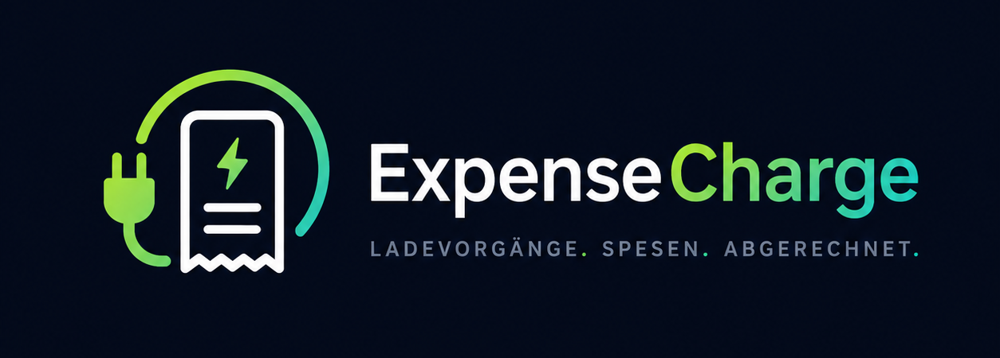
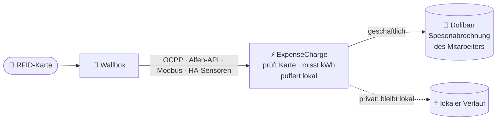
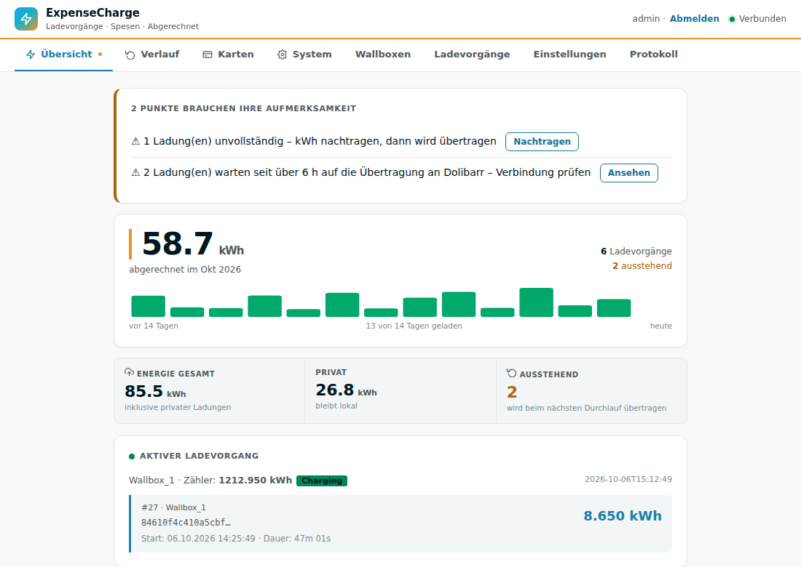
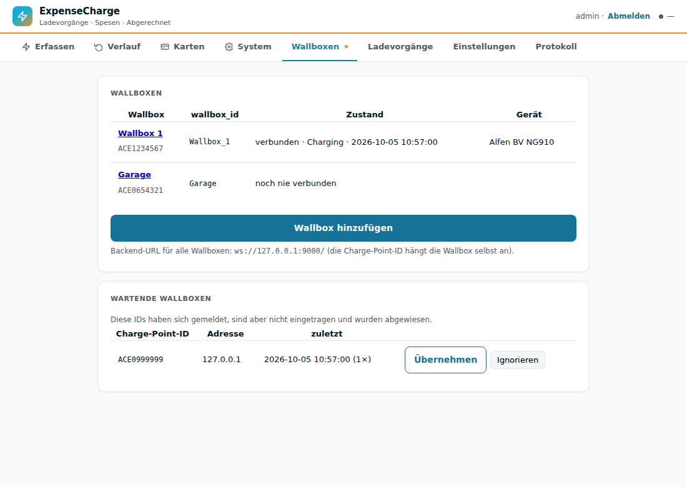
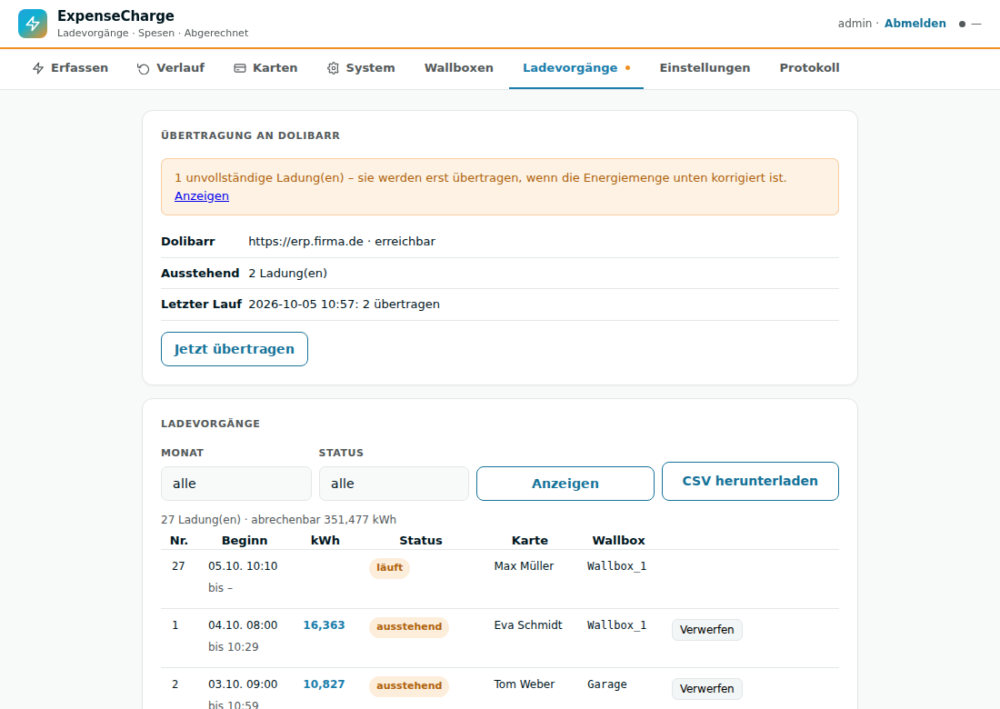
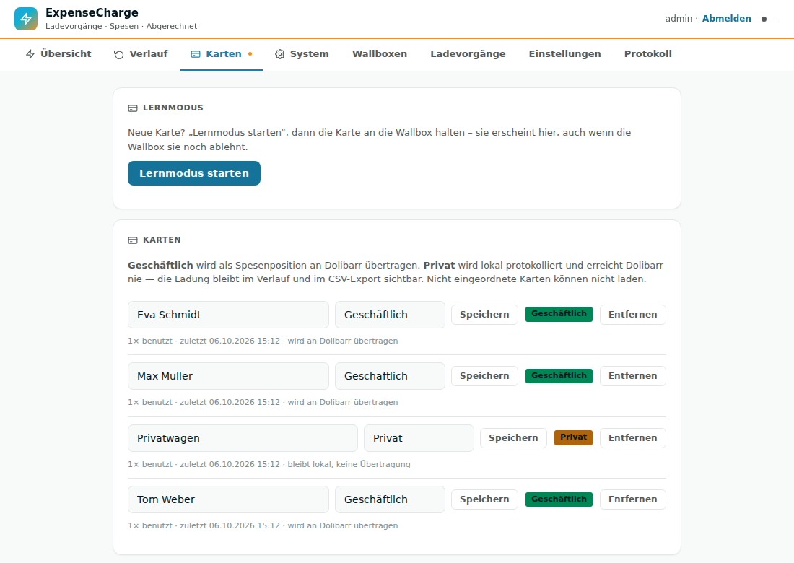
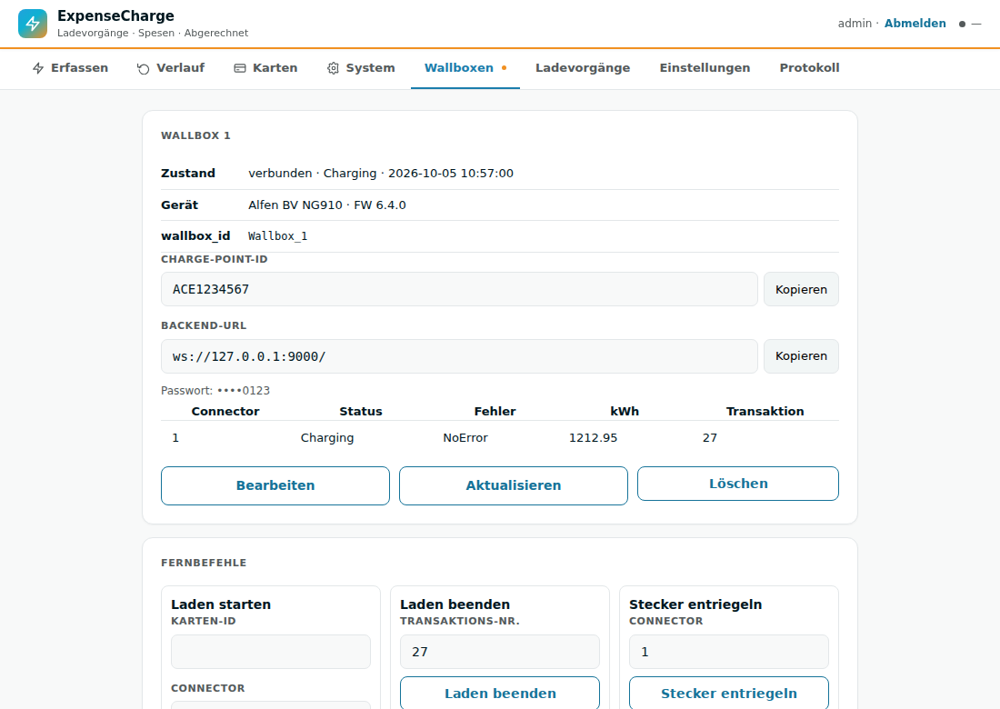
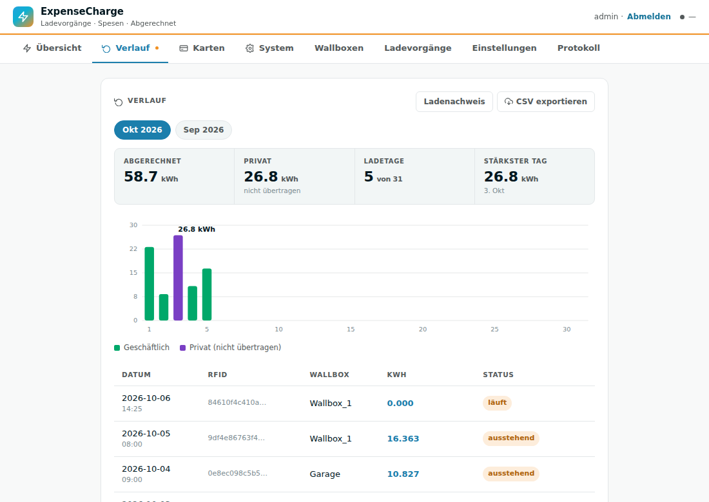
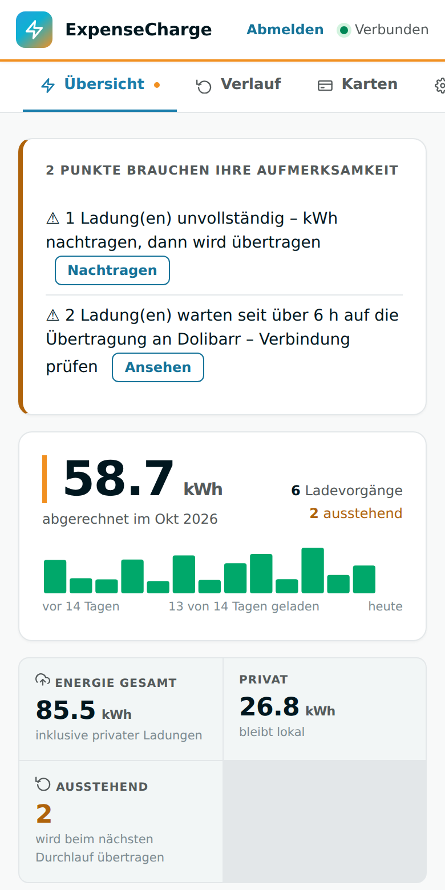

<p align="center">
  
</p>

<p align="center">
  <b>Dienstwagen an der Firmen-Wallbox laden — und die Ladung steht automatisch in der Spesenabrechnung.</b><br>
  RFID-Karte vorhalten, laden, fertig: ExpenseCharge erfasst jeden Ladevorgang und schreibt ihn
  direkt als Position in die <b>Dolibarr</b>-Spesenabrechnung des richtigen Mitarbeiters.
</p>

<p align="center">
  
  
  
  
  
  
  
</p>

<p align="center">
  <a href="#-was-es-kann">Funktionen</a> ·
  <a href="#-welche-variante-passt">Varianten</a> ·
  <a href="#-installation">Installation</a> ·
  <a href="#-dokumentation">Dokumentation</a> ·
  <a href="#-sicherheit--datenschutz">Sicherheit</a>
</p>

---

## So funktioniert's



1. **Karte vorhalten** — ExpenseCharge prüft, ob sie laden darf (bei OCPP: unbekannte Karten laden nicht).
2. **Laden** — Start, Ende und Zählerstände kommen direkt von der Wallbox.
3. **Abgerechnet** — die Ladung landet als Zeile „Wallbox 1: 12.50 kWh“ in der Spesenabrechnung
   des Monats; Dolibarr legt den Entwurf bei Bedarf selbst an und rechnet mit dem hinterlegten €/kWh-Preis.

Kein Cronjob, keine eigene Abrechnungsseite, kein Export/Import — alles landet nativ im
Spesenmodul von Dolibarr. Ist Dolibarr mal nicht erreichbar, bleibt nichts liegen: Ladungen
werden lokal gepuffert und nachgereicht.

## 📸 Einblick

<table>
  <tr>
    <td width="50%"><br><sub><b>Übersicht</b> — abgerechnete kWh, Tagesstreifen, laufende Ladung live</sub></td>
    <td width="50%"><br><sub><b>Wallboxen</b> — Live-Zustand, wartende Wallboxen per Klick übernehmen</sub></td>
  </tr>
  <tr>
    <td><br><sub><b>Ladevorgänge</b> — Übertragungsstatus, Filter, CSV, Nachbearbeitung</sub></td>
    <td><br><sub><b>Karten</b> — Lernmodus, geschäftlich oder privat</sub></td>
  </tr>
  <tr>
    <td><br><sub><b>Wallbox-Details</b> — Fernbefehle, Konfiguration, OCPP-Protokoll</sub></td>
    <td><br><sub><b>Verlauf</b> — Monatsauswertung geschäftlich/privat</sub></td>
  </tr>
</table>

<p align="center"><br><sub>Funktioniert auch auf dem Smartphone</sub></p>

## ✨ Was es kann

### Erfassen — herstellerunabhängig

| Betriebsart | Für wen | Besonderheit |
|---|---|---|
| **OCPP 1.6J** (`ocpp`) | alle Wallboxen mit OCPP — Alfen, ABL, Keba, go-e, Mennekes, Easee, Zaptec, … | ExpenseCharge ist der Zentralserver: **echte Zugriffskontrolle**, mehrere Wallboxen in einer Instanz, Wallbox puffert offline |
| **Alfen HTTPS-API** (`alfen_http`) | Alfen Eve | Zähler, Zustand und Karte aus einer Quelle — **ohne** den OCPP-Slot zu belegen, parallel zum Cloud-Backend |
| **Modbus TCP** (`modbus`) | Wallboxen mit Modbus | direkt abgefragt, frei konfigurierbare Registerkarte |
| **Home-Assistant-Sensoren** (`ha_sensors`) | alles, was HA schon kennt | Karte, Zähler und Zustand aus HA-Entitäten; auch Wallboxen ohne eigenen Zähler (z.B. mit Shelly EM) |

### Abrechnen — direkt in Dolibarr
- Jede geschäftliche Ladung wird eine Position in der **Spesenabrechnung des Mitarbeiters**, im Monat des Ladeendes
- Mehrere Karten pro Mitarbeiter, Preis je Karte oder global (€/kWh)
- **Duplikatschutz**: dieselbe Ladung wird nie doppelt abgerechnet, auch bei Wiederholungen
- **Ladenachweis für das Finanzamt**: je Mitarbeiter und Monat mit Zählerständen, als PDF oder CSV — passend zur
  Erstattung nach BMF-Schreiben vom 11.11.2025 (seit 2026 nur gegen Nachweis der kWh; Strompreis-Pauschale
  2026: 34 ct/kWh); standalone am Monatsanfang automatisch per E-Mail an Buchhaltung und Mitarbeiter
- Lehnt Dolibarr eine Ladung ab (z.B. Karte keinem Mitarbeiter zugeordnet), wird sie zurückgestellt — alle
  anderen werden weiter übertragen
- Ladungen werden lokal gepuffert (SQLite) und bei Ausfall automatisch nachgereicht
- Unplausible Messungen werden als **unvollständig** markiert statt falsch abgerechnet — und lassen sich von Hand korrigieren

### Karten — geschäftlich oder privat
- **Lernmodus**: Karte an die Wallbox halten, im Browser benennen und einordnen
- **Geschäftlich** wird abgerechnet, **privat** lädt, bleibt aber lokal und erreicht Dolibarr nie
- Karten auch manuell per ID anlegen; Mitarbeiternamen aus Dolibarr als Vorschlag
- Karten-IDs werden nur als SHA-256-Hash gespeichert, nie im Klartext geloggt

### Verwalten — komplett im Browser
Ohne Home Assistant (standalone) ist die Web-Oberfläche zugleich die Verwaltung — keine JSON-Datei von Hand:

| Bereich | Was geht |
|---|---|
| **Ersteinrichtung** | Assistent: Admin-Konto, Dolibarr (mit Verbindungstest), erste Wallbox, Karten |
| **Wallboxen** | anlegen mit Passwort-Generator, Live-Zustand, unbekannte Wallboxen übernehmen, **Fernbefehle** (Laden starten/beenden, entriegeln, Neustart, …), Wallbox-Konfiguration lesen/ändern, empfohlene Einstellungen, OCPP-Protokoll |
| **Ladevorgänge** | Filter nach Monat/Status, CSV-Export, Ladenachweis, Übertragungsstatus, „Jetzt übertragen“, Unvollständiges abschließen oder verwerfen, Abgelehntes erneut senden |
| **Einstellungen** | Betriebsparameter, Admin-Passwort, **Backup & Wiederherstellung** per Klick plus automatisch jede Nacht, **Benachrichtigung per E-Mail/Webhook**, wenn etwas liegen bleibt, Systeminfo |
| **Protokoll** | jede Änderung mit Benutzer und Zeit, System-Log zum Filtern und Herunterladen |

Anmeldung mit eigenem Admin-Konto, dazu Konten für die **Buchhaltung** (alles lesen, nichts ändern) und für
**Mitarbeiter** (nur die eigenen Ladungen und der eigene Ladenachweis). Schutz gegen CSRF und Passwort-Raten,
Geheimnisse nur maskiert.

## 🧭 Welche Variante passt?

| | 🏠 Home-Assistant-Addon | 🐳 Standalone (Docker) |
|---|---|---|
| **Ideal, wenn** | Home Assistant schon läuft | kein HA vorhanden oder gewollt — z.B. Proxmox-LXC, Raspberry Pi, Server |
| **Betriebsarten** | alle vier | `ocpp`, `alfen_http`, `modbus` |
| **Einrichtung** | Addon-Store, Konfiguration in HA | im Browser per Assistent |
| **Oberfläche** | HA-Ingress (HA-Login) | eigene Verwaltung mit Admin-Konto |
| **Updates** | über den Addon-Store | `git pull` + neu bauen |

## 🚀 Installation

Beide Varianten brauchen zuerst das **Dolibarr-Modul**.

### 1 · Dolibarr-Modul

1. `module_wallboxbilling-*.zip` aus diesem Repository im Dolibarr-Modulmanager hochladen und aktivieren
2. Unter *ExpenseCharge Konfiguration*: Preis pro kWh und **API-Token** setzen
3. RFID-Karten den Mitarbeitern zuordnen (Tab *RFID-Verwaltung*)

### 2a · Home-Assistant-Addon

1. *Einstellungen → Add-ons → Add-on-Store → ⋮ → Repositories* →
   `https://github.com/systemwerk-GmbH-Co-KG/ExpenseCharge`
2. **ExpenseCharge** installieren, Dolibarr-URL und API-Token eintragen, Betriebsart wählen, starten
3. Oberfläche über *Benutzeroberfläche öffnen* (oder „In Seitenleiste anzeigen“)

### 2b · Standalone mit Docker

```bash
git clone https://github.com/systemwerk-GmbH-Co-KG/ExpenseCharge.git
cd ExpenseCharge/wallbox-dolibarr
mkdir -p data && cp options.standalone.example.json data/options.json
echo "WEB_BIND=0.0.0.0" > .env
docker compose up -d --build
docker compose logs expensecharge | grep Einrichtungscode
```

Dann `http://<Server-IP>:8099/` öffnen — der Assistent führt durch den Rest.
Schritt für Schritt mit Proxmox-Container, Sicherung und Update:
**[INSTALL.md → Standalone](INSTALL.md#35--variante-standalone-docker-ohne-home-assistant-zb-proxmox-lxc)**

### 3 · Wallbox anbinden

Per OCPP in acht Schritten bis zur ersten abgerechneten Ladung:
**[docs/OCPP-WALLBOX-ANBINDEN.md](docs/OCPP-WALLBOX-ANBINDEN.md)**

## 📚 Dokumentation

| Dokument | Inhalt |
|---|---|
| [INSTALL.md](INSTALL.md) | Installation komplett: Dolibarr-Modul, HA-Addon, Standalone/Proxmox, Funktionsprüfung, Fehlerbehebung, Upgrade |
| [docs/OCPP-WALLBOX-ANBINDEN.md](docs/OCPP-WALLBOX-ANBINDEN.md) | Wallbox per OCPP anbinden, Schritt für Schritt, mit Alfen-Einstellungen und Fehlerbildern |
| [wallbox-dolibarr/README.md](wallbox-dolibarr/README.md) | Referenz: alle Betriebsarten (OCPP, Alfen-API, Modbus, HA-Sensoren), Wallbox-Profile, Karten, Standalone-Betrieb, Konfiguration |

## 🔒 Sicherheit & Datenschutz

- **Karten-IDs** nur als SHA-256-Hash gespeichert; Klartext nie im Log, nur flüchtig im Lernmodus
- **Private Ladungen** erreichen Dolibarr nie — geprüft wird die aktuelle Einordnung beim Senden
- **OCPP** mit Passwort je Wallbox; unbekannte Wallboxen und Karten werden abgewiesen, Passwort-Raten wird gesperrt
- **Heimladen verschlüsselt**: Wallboxen bei Mitarbeitern verbinden sich über `wss://` (TLS, Security Profile 2) mit
  automatischem Zertifikat; die Verwaltung bleibt dabei aus dem Internet gesperrt
- **Verwaltung** nur angemeldet: gehashte Passwörter, Sperre nach Fehlversuchen, CSRF-Schutz, Änderungsprotokoll
- **Dolibarr** über ein gemeinsames API-Token; Modul-Deinstallation löscht keine Daten
- Empfohlen: Web-UI und Port 9000 nur im LAN/VPN; über das Internet nur verschlüsselt über den TLS-Proxy

## 🗂️ Projektstruktur

```
ExpenseCharge/
├── Dolibarr/htdocs/custom/wallboxbilling/   Dolibarr-Modul (receive.php, employees.php, Konfiguration)
├── wallbox-dolibarr/                        Addon bzw. Standalone-Container
│   ├── main.py                              Start, Betriebsarten, Übertragung
│   ├── ocpp_server/                         OCPP-1.6J-Zentralserver
│   ├── alfen_source/ · modbus_source/       weitere Datenquellen
│   ├── admin/                               Verwaltungsoberfläche (standalone)
│   ├── web_server.py                        Web-Oberfläche
│   ├── session_manager.py                   SQLite-Puffer, Karten, Ladevorgänge
│   ├── api_client.py                        Übertragung an Dolibarr
│   ├── docker-compose.yml · Dockerfile      Standalone-Betrieb
│   └── tests/                               Testsuite
├── docs/                                    Anleitungen, Screenshots, Branding
├── INSTALL.md                               Installationsanleitung
└── module_wallboxbilling-*.zip              Dolibarr-Modul zum Hochladen
```

## Lizenz & Support

Proprietär — alle Rechte vorbehalten, siehe [LICENSE](LICENSE).
GitHub: [systemwerk-GmbH-Co-KG/ExpenseCharge](https://github.com/systemwerk-GmbH-Co-KG/ExpenseCharge)
